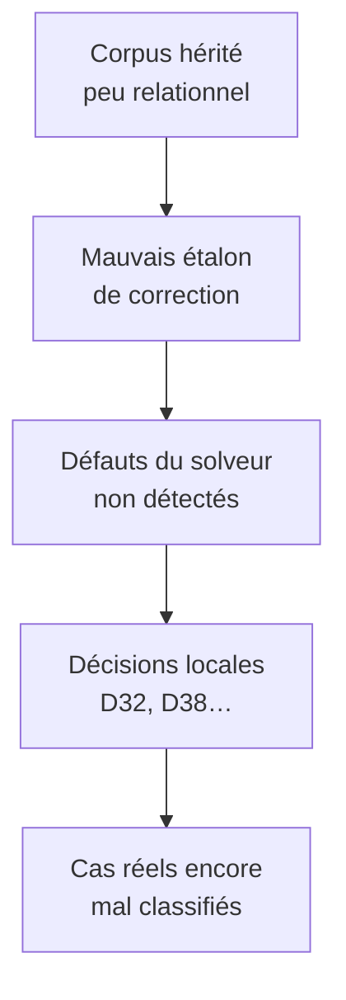

Cette réponse est globalement plus précise que la mienne sur deux points, parce qu’elle a vérifié le code. Mais sa conclusion « ce n’est pas l’architecture, c’est le corpus » est trop exclusive. Le corpus est bien la cause première du mauvais pilotage ; il a aussi laissé se figer de vrais défauts dans l’architecture d’inférence.

## Ce que je corrige dans mon analyse

### D38 : le mécanisme exact

J’ai attribué trop directement le `HIGH` au besoin de franchir le seuil du générateur. Le code montre que :

* `OfferedContract` émet en S4 ;
* S2, S3 et S4 sont tous traduits mécaniquement en `Confidence.HIGH` ;
* le seuil `HIGH` ne distingue donc pas R5 de R5b.

Le défaut fondamental est bien l’écrasement de trois niveaux d’évidence sur une seule confiance. La formulation du chantier — « confiance HIGH, sans quoi le seuil refuserait » — rationalise le résultat, mais ce n’est pas la règle qui force explicitement `HIGH`.

### Le corpus est plus gravement déséquilibré que je ne l’avais formulé

Les chiffres donnés sont accablants :

* 77 scénarios mono-type ;
* 120 sur 143 avec au plus deux types ;
* seulement 23 scénarios réellement relationnels ;
* 122 scénarios portant encore la forme et le nom des anciens tests ;
* seulement 21 scénarios conçus spécifiquement pour le nouveau moteur.

Le corpus n’est toutefois plus exactement l’oracle de l’ancien moteur : beaucoup d’attentes ont été ré-arbitrées vers `UNCLASSIFIED`. La contamination réside surtout dans la forme des questions posées. Même avec la « bonne » réponse, une fixture mono-type ne peut pas tester sérieusement un moteur dont la thèse est que le rôle dépend de la position dans un graphe.

Il produit donc surtout une illusion de couverture : 154 goldens verts, mais très peu de graphes capables d’exercer les propagations annoncées.

## Là où je nuance son diagnostic

Dire que l’architecture n’est pas en cause va trop loin.

L’architecture modulaire du document 07 reste bonne : frontend, modèle, moteur et backends sont correctement séparés. En revanche, l’architecture du solveur comporte une contradiction réelle.

Le document promet une inférence monotone, mais les règles utilisent des raisonnements comme :

* personne ne détient ce contrat ;
* rien du cœur ne l’implémente ;
* aucun adapter ne l’appelle ;
* aucun autre candidat ne remplit telle condition.

C’est de la négation par absence dans un périmètre considéré fermé. Une telle conclusion peut devenir fausse lorsqu’un fait ou un verdict apparaît plus tard. Elle n’est pas compatible avec un Datalog strictement monotone et additif.

Il faut choisir explicitement entre :

* une négation stratifiée, exécutée après stabilisation des faits positifs ;
* un système de maintien de vérité capable de retirer les conclusions dont le support disparaît ;
* ou des règles d’absence limitées à des hypothèses faibles, jamais suffisantes pour produire seules un verdict générable.

Le code actuel a implicitement choisi une forme de maintien de vérité en recalculant tout à chaque tour, mais sans conserver les preuves inter-tours. Ce n’est pas seulement une documentation périmée : c’est un compromis architectural incomplet qui casse l’invariant d’explicabilité.

La bonne chaîne causale est donc :

Le corpus est la cause de gouvernance. Le solveur et l’échelle de confiance sont les dettes techniques qu’il a laissé passer.

## Je suis d’accord sur les trois mesures proposées, avec un ajustement d’ordre

Il faut effectivement arrêter M7b avant le lot 5. Mais « rebaser le corpus » suppose d’abord de définir ce que signifie correct. Sinon, on remplacera simplement un oracle implicite par un autre.

Je procéderais ainsi.

### 1. Définir le contrat de vérité du produit

Avant tout correctif, écrire ce que chaque consommateur attend :

| Consommateur | Ce qu’il peut accepter                                               |
| ------------ | -------------------------------------------------------------------- |
| Living doc   | Verdicts, hypothèses et ambiguïtés clairement distingués             |
| Audit        | Ambiguïtés, inconnus et classifications provisoires                  |
| Validation   | Politique configurable appliquée à ces résultats                     |
| Génération   | Relations démontrées et capacités vérifiées pour le backend concerné |

Cela interdit notamment de changer la confiance d’un verdict pour satisfaire un générateur.

### 2. Recomposer le dispositif de tests

Les scénarios actuels ne doivent pas être supprimés, mais séparés selon leur fonction :

* **Fixtures de règles** : les cas mono-type, y compris les silences honnêtes.
* **Invariants négatifs** : une interface isolée n’est pas automatiquement un port.
* **Tests métamorphiques** : renommer, dupliquer un signal ou ajouter une recherche secondaire ne doit pas modifier indûment le résultat.
* **Corpus d’acceptation** : graphes complets et câblés, avec vérité métier relue.
* **Projets réels** : les `_probes/` deviennent des cas d’acceptation reproductibles, pas seulement des bancs exécutés après la clôture.

Le cliquet de conformité ne doit porter que sur les deux dernières catégories. Les fixtures héritées restent utiles, mais elles ne doivent plus gonfler artificiellement la mesure de couverture fonctionnelle.

### 3. Corriger la sémantique des mesures

Il faut trois notions indépendantes :

* le **palier d’évidence** : S1 à S6 ;
* la **confiance dans le verdict** : résultat de preuves indépendantes et éventuellement contradictoires ;
* l’**autorisation d’usage** : audit, validation ou génération par un backend précis.

S2, S3 et S4 ne peuvent plus tous devenir automatiquement `HIGH`. De même, deux occurrences de R7 ne doivent compter que comme une famille de preuve, sauf si elles reposent sur deux ancres réellement indépendantes.

### 4. Réparer la gouvernance des décisions

Le registre est formellement confirmé par l’utilisateur, mais l’exécutant contrôle aujourd’hui largement le cadrage, les options et les mesures présentées. C’est là que se situe le biais.

Je séparerais :

* `OBSERVATIONS.md` : faits mesurés, sans conclusion ;
* `PROPOSITIONS.md` : options, contre-exemples et impacts prévus ;
* `DECISIONS.md` : arbitrage utilisateur seulement.

Une découverte faite dans un lot ne devrait plus être tranchée et implémentée dans ce même lot. Et « débloque M7b » ne devrait jamais constituer un argument de correction fonctionnelle.

## Ne pas rouvrir les neuf décisions maintenant

Sur ce point, l’autre IA a raison. Ma liste était un inventaire des décisions suspectes, pas un ordre d’exécution. Les rouvrir immédiatement une par une reproduirait la conduite du chantier.

Il faut les placer dans une file de réévaluation, par familles :

* solveur et preuves : D6, D33, D38 ;
* modèle métier : D7, D13, D16 ;
* génération : D27, D30, D34, D35 ;
* périmètre des sources : D15, D19.

Chaque famille ne sera rouverte que si le nouveau corpus réel apporte un cas nominal, un contre-exemple et une mesure d’impact.

En conclusion : l’autre analyse identifie mieux la faute initiale de méthode. Le chantier a déclaré la victoire avec un corpus dont la majorité des scénarios ne pouvait pas exercer sa proposition centrale. Mais ce mauvais étalon a ensuite permis à trois problèmes architecturaux de s’installer : non-monotonie mal formalisée, preuves inter-tours perdues et échelle de confiance écrasée. Il faut donc refaire l’étalon avant les règles, puis corriger le solveur avant de reprendre les décisions métier.
